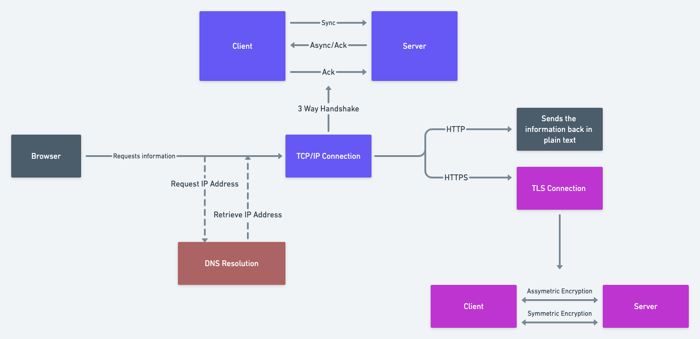

We all know that Internet is a network of networks. It helps connect every system in the world. I can sit in my desk and request for some information and I will get it within a matter of seconds. How is it possible that a machine can retrieve information about something so random.

When I type in "google.com" on the browser and hit enter, the browser calls an API (Application Interface Protocol) through which it sends my data and responds back with the answers I want. The question that arises here is how does the API know who to contact to get the right data back?

Here the concept of IP Addresses come into play. Each and every device connected to the internet has an IP Address which they use to communicate. Google has its own IP Address and so does your device. The IP Address is retrieved through a DNS Resolution. Once the IP Address is retrieved a connection can be established to send information to and fro.

This connection that lets the client and server communicate is called the TCP/IP connection. The TCP/IP connection is made possible via a concept called a "3 Way Handshake", the textbook definition of which is Client sends a Sync request to the Server, Server sends an Async and Acknowledgement back and then the Client sends an Acknowledgement. But why is this needed?

Client needs to check if a Server with the said IP Address exists. If the server does exist it responds back saying "hey! yeah I am here". But this is where it also establishes how data will be transferred. Data transfer takes place through packets. This is because a machine cannot understand plain text, it only understands bytes of data. The plain text that we type in is converted to bytes and transferred using packets. There can be multiple packets sent across. How does the client understand how many packets it needs to retrieve.

Here the concept of serialization comes to play. Packets are always sent in an ordered manner. Say for example, the Server sends a packet numbered 2, the next packet has to be 3, so on and so forth. So the Acknowledgment that Server sends the Client, it basically says that "Hey! I am going to be sending packets that are numbered from X". The Client understands this and responds back saying "I am also going to be sending packets numbered from Y".

There is another reason why serialization is needed. When you look up for anything on the internet, it can go to multiple places before it reaches back to you with the information. When it goes to multiple places there is a probability that some packet goes missing. Suppose the Client only receives packets 2, 4 and 6, it knows that it is missing packets 3 and 5 because packets are always numbered serially. This way the Client can hit back at the server and request packets 3 and 5, and the Server will send back the requested packets.

Once these said rules are established, then a decision is made as to the information that is going to be sent back to the user will it be in HTTP format or in HTTPS format.

HTTP refers to Hypertext Transfer Protocol and HTTPS refers to Hypertext Transfer Protocol Secure. By looking at the names we can come to a conclusion that HTTPS is a more secured address. If the response is just an HTTP address, the information is sent back to the user in plain text format. But what happens if a secured connection needs to be established?

Since HTTPS is secured, the data needs to be encrypted before it is sent to the client. For a secured connection we have a concept called TLS Handshake in place. It is an updated version of SSL Handshake. During the TLS Handshake there are two major steps that take place:

1. Asymmetric Encryption
2. Symmetric Encryption

If we need to encrypt any text, to decrypt it back we need to know how the encryption had taken place. Machines do this through a secret key. The Client pings the Server and starts the handshake with a hello. The server responds back saying "Hey, this is the certificate of proof of server". The Client verifies this given certificate and confirms that the server is who they say they are and that the client is interacting with the actual owner of the domain. The server sends the "premaster secret" which is encrypted with the public key and the server can only decrypt it, as the server only has the access to the private key. The server decrypts the message, then both the client and server generate sessions keys which will be the same for the both following the given standards. Once the session keys are generated the both send messages saying they are ready using the "session keys". This entire connection that was established refers to asymmetric encryption.

Once this connectivity is established the client and server communicate through a symmetric encryption. This is because symmetric encryption is faster to compute compared to asymmetric encryption. The reason why both of them exist is because once asymmetric encryption has been achieved, it is very hard for a human with their system to decrypt it. We need a lot of servers to decrypt the secret key. This is how a secured connection is established.
